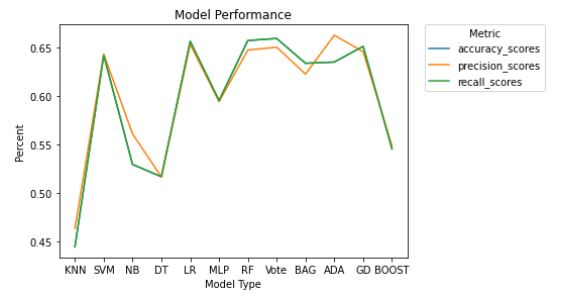
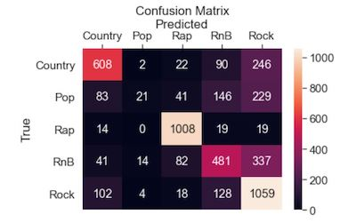
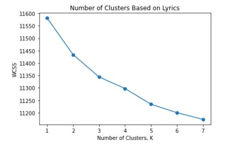

# Song Genre Classification
### Trevor Andrus, Sam Johnson, Connor Greenhalgh

## Introduction

Music genre helps listeners cluster songs that they enjoy. A song's genre is decided by a variety of factors, some of which include: rhythm, tempo, lyrics, and key. We are interested in seeing whether a song's genre can be identified by its lyrics alone. We are also interested in how many genres an unsupervised algorithm would deem optimal, given a list of songs. 

## Data Collection and Cleaning

To build our model, we required a good amount of lyric data. We gathered this data using [genius' api](https://docs.genius.com/) and partitioned our data gathering over 5 genres of interest. The genres we selected were country, rock, rap, r&b, and pop. For our sample, we took the top 50 songs of the top 50 artistis in each genre (if that many songs were available). If an artist was featured in more than one genre, we removed them from our analysis. Our sample resulted in the following totals:

| Genre  | Counts |
| ------------- | ------------- |
| Country  | 2,419  |
| Rock  | 3,277  |
| Rap  | 2,650  |
| Rhythm and Blues  | 2,388  |
| Pop  | 1,300  |

After gathering the data, furthre cleaning and processing was necessary. We began by removing all lyric's punctuation, trademarks, and other tags that were included in the strings returned from the Genius API. We then removed stop words using the default options provided in the nltk packages, and lematized the lyrics. Lematizing describes the process of reducing words with prefixes and suffixes to their base meaning - For example, running becomes run, and waited becomes wait. We then tokenized the lyrics, treating each word as an individual entity. After tokenizing, we then vectorized using two methods: count vectorization, and Tf-idf score. Count vectorization involves creating binary dummy variables representing the existence of each word in a song, and Tf-idf vectorization takes things a step further, and adds weights to words based on their importance. 

## EDA

Exluding stop words, we found the following words to be the most prominent in each genre:

<table>
<tr><th>Country </th><th>Pop</th><th>Rock</th><th>Rhythm and Blues</th><th>Rap</th></tr>
<tr><td>

| Word  | Counts |
| ------------- | ------------- |
| Love  | 3,716  |
| Baby  | 2,798  |
| Time  | 2,645  |
| Girl  | 2,455  |
| Little  | 2,181  |
  
</td><td>  

| Wod  | Counts |
| ------------- | ------------- |
| Love  | 4,324  |
| Baby  | 2,482  |
| Want  | 1,845  |
| Wanna  | 1,702  |
| Say  | 1,659  |
  
</td><td> 

| Word  | Counts |
| ------------- | ------------- |
| Love  | 4,927  |
| Time  | 3,124  |
| Come  | 2,877  |
| Want  | 2,522  |
| See  | 2,501  |

</td><td>

| Word  | Counts |
| ------------- | ------------- |
| Love  | 11,976  |
| Baby  | 7,442  |
| Time  | 3,539  |
| Want  | 3,332  |
| Come  | 3,225  |

</td><td>

| Word  | Counts |
| ------------- | ------------- |
| N****  | 17,797  |
| B****  | 11,546  |
| F***  | 7,819  |
| S***  | 7,487  |
| Love  | 4,592  |

</td></tr> </table> 

## Methods and Results

We split the model into training and test data, then compared the accuracy of 12 different models to determine which we wanted to move forward with. 

The logistic regression model seemed to have the highes accuracy, but we chose the to move forward with a random forest model. We chose the random forest for the sake of interperability. Logistic regressions with multiple predictors get fairly hairy when trying to interpret coefficients, and although random forests may not be that much better in this aspect, we could more easily determine the importance of words.  Below is the list of words we found most important for prediction:

| Rank Of Importance  | Word |
| ------------- | ------------- |
| 1  | nice |
| 2  | frozen  |
| 3  | birthday  |
| 4  | ship  |
| 5  | ba  |
| 6  | louder  |
| 7  | gold  |
| 8  | wallet  |
| 9  | electric  |
| 10  | f***  |

After prediction, we looked at the following confusion matrix to see how well our model assigned genres. 

Incedentally, rap by far had the highest prediction accuracy. (Most likely because of its unique and repeated use of profanity).  Rock also had a fairly good predicion accuracy, but its precision was mediocre. We saw many other genres falsely identified as rock. 

We then turned to unsupervised methods in order to determine if the algorithm thought there was another ideal number of clusters besides the 5 genres we originally added. 

We didn't find much from the WCSS plot, suggesting there isn't really an "ideal" number of clusters - interestingly, we don't even really see a significant indication that 5 clusters (genres) are especially helpful either.

Going back to our assumed 5 genres, the K means algorithm suggested the following for likely lyrics in each category. 
(Again from the expletives it is fairly easy to point out the "rap" cluster. With the exception of this cluster, however, it is not very apparent which cluster aligns with which genre. 

| Group  | Words |
| ------------- | ------------- |
| 1  | time come night never see take girl right say make |
| 2  | baby love come time want wanna need girl take say  |
| 3  | n**** b**** f*** s*** ayy gon money em wanna huh  |
| 4  | love want baby heart need never feel say time wanna  |
| 5  | la na ah da tell feel love song want  |

## Limitations

Ideally we would have liked to pull songs by genre directly from the Genius API, but that feature seemed limited. We faced quite a few time out errors, and resorted to pulling lyrics by artist specifically. This may lead to errors in what song we place in which genre (because individual artists may consider themselves a blend of multiple genres). 

Song date also serves as another point of concern. With the exception of pop, our sampled data featured songs from multiple decades of music. As such, speech likely changes over time, and may make it harder for our model to correctly identify the genre of a given song. (For example, a rap song from 20 years ago likely differs greatly from rap songs of today). 

## Conclusion

In conclusion, we see that sorting songs into genres solely based on lyrics may potentially be feasible, but not practically possible with any sort of reliable accuracy. While we do see fairly good scores in the rap and rock categories, the remaining genres showed fairly dismal outcomes. Our findings could, however, provide the basis for a sort of "Rap song identifier" that can identify in a binary response whether or not a song belongs to the rap genre. However, in this case it may just be easier to create a dictionary of profanity, and compare the lyrics to that dictionary. Particularly, rap was the only genre that used a certain racial slur, and simply looking for that slur in lyrics could prove accurate in identifying the rap genre. 

Our analysis goes to show that while lyrics do contribute to what determines a song's genre, there are many more aspects that need to be viewed in unison to make assumptions on a song-by-song bases. Attributes such as a song's beat, tempo, and tonality may serve as better predictiors than just lyrics alone. 
